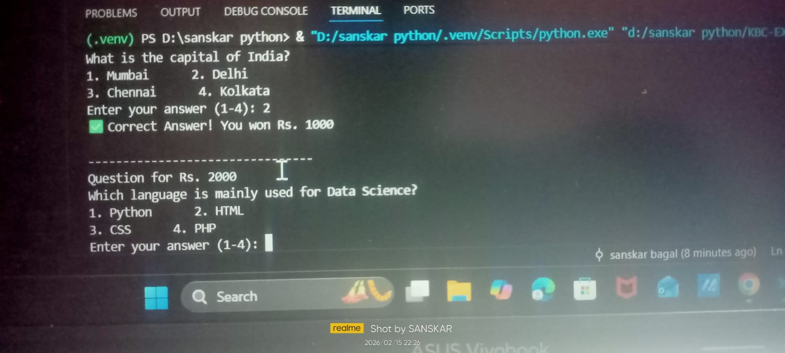

# 🎮 Exercise Title  
KBC – Python Mini Exercise

---

## 🎯 One-Line Summary (Objective)  
To create a simple Python-based quiz game inspired by Kaun Banega Crorepati (KBC) using conditional statements and basic programming logic.

---

## 📚 Table of Contents  
<ul>
  <li><a href="#overview">Overview</a></li>
  <li><a href="#problem-statement">Problem Statement (Business Problem)</a></li>
  <li><a href="#tools--technologies-used">Tools & Technologies Used</a></li>
  <li><a href="#method">Method</a></li>
  <li><a href="#key-insights">Key Insights</a></li>
  <li><a href="#output">Output</a></li>
  <li><a href="#how-to-run-the-program">How to Run the Program</a></li>
  <li><a href="#result--conclusion">Result & Conclusion</a></li>
  <li><a href="#author--contact">Author & Contact</a></li>
</ul>

---

## 🧾 Overview  
  
This mini project is a console-based quiz game inspired by the popular Indian television show **Kaun Banega Crorepati (KBC)**.  

The program asks multiple-choice questions and checks the user's answers. Based on correct responses, the user progresses through the game and wins virtual prize money.

The project helps beginners understand:
- Conditional statements  
- Loops  
- User input handling  
- Basic game logic  

---

## 🏢 Problem Statement (Business Problem)  
  
Interactive quiz systems are widely used in educational platforms, online competitions, and entertainment applications.  

This exercise simulates a simplified quiz game system that:
- Asks questions  
- Validates answers  
- Tracks user progress  
- Displays results  

---

## 🛠️ Tools & Technologies Used  
  
- Programming Language: Python  
- IDE: VS Code  
- Platform: Windows  
- Concepts Used: Conditional Statements, Loops, Variables  

---

## 🔧 Method  
  
1. Display welcome message  
2. Present multiple-choice questions  
3. Take user input for answers  
4. Compare input with correct answer  
5. Increase prize money for correct answers  
6. End game if answer is incorrect  

---

## 💡 Key Insights  
  
- Learned how to build basic game logic  
- Practiced `if-elif-else` conditions  
- Improved understanding of loops  
- Learned how to validate user input  
- Built confidence in writing interactive programs  

---

## 📤 Output  
  

### Program Output Screenshot  

---

## ▶️ How to Run the Program  
  

1. Install Python: https://www.python.org/downloads/  
2. Save your file as:
3. Run the program:

---

## ✅ Result & Conclusion  
  
This mini exercise successfully demonstrates:
- Interactive console-based programming  
- Logical decision-making  
- Basic game development concepts  

It is a beginner-friendly project suitable for GitHub portfolios and academic submissions.

---

## 👨‍💻 Author & Contact  
  

**Author:** Sanskar Bagal  

🔗 LinkedIn:  

www.linkedin.com/in/sanskar-bagal-664836307

📧 Gmail:  
mailto:sanskarbagal2552@gmail.com

---

⭐ If you found this project helpful, consider giving it a star on GitHub!
